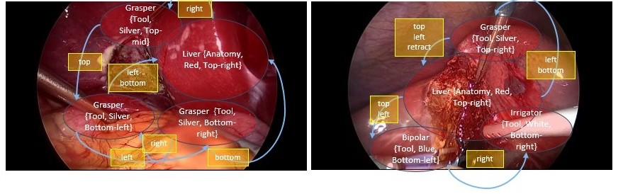
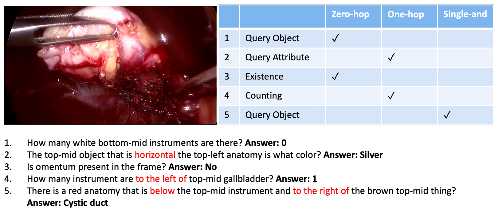
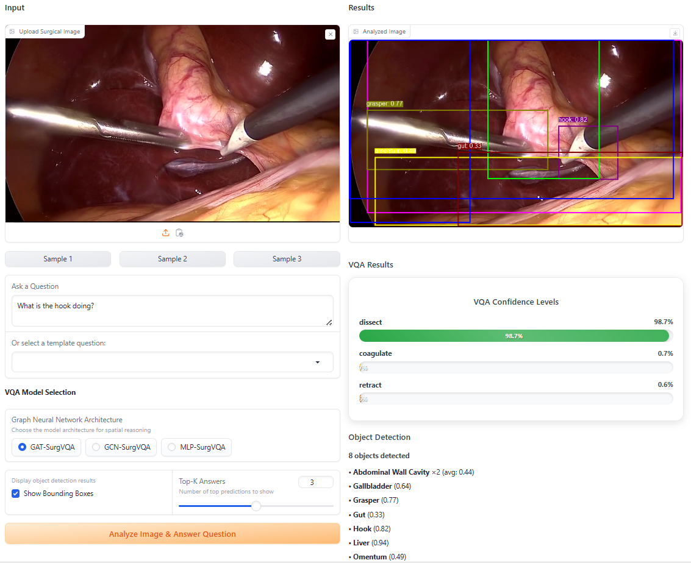

# GNN-SurgVQA: Object-Centric Graph Reasoning for Visual Question Answering in Laparoscopic Scene Understanding

## I. Overview

Minimally Invasive Surgery (MIS), particularly Laparoscopic Cholecystectomy (LC), has become the standard treatment for gallbladder diseases due to reduced tissue trauma and faster recovery. Meanwhile, current research in Surgical Data Science (SDS) primarily targets low-level perception tasks such as phase recognition and segmentation, offering limited relational reasoning or contextual understanding. Existing Visual Question Answering (VQA) models in surgery often rely on grid-based visual features or post-hoc explanations, lacking explicit semantic structure and inherent interpretability. This study introduces GNN-SurgVQA, a multimodal framework based on object-centric graph reasoning for laparoscopic scene understanding. The architecture integrates core components: object detection using YOLOv8n, question encoding via BioClinicalBERT, and graph-based relational reasoning using Graph Neural Networks (GNNs), followed by multimodal fusion through cross-modal attention and Transformer encoding. GNN-SurgVQA provides semantic-level interpretability through bounding boxes, scene graphs, and two-stage attention visualizations.


*Examples of surgical scenes and semantic scene graphs [1]*


*An example of image–question pairs and corresponding question categories [1]*


*GNN-SurgVQA Architecture*

## II. Repository Structure
The repository is organized as follows:

## III. Environment Setup and Installation
To ensure reproducibility and facilitate deployment, the GNN-SurgVQA framework is distributed with environment configuration files for both demonstration and training purposes. The following steps outline the recommended procedure for setting up the computational environment and installing all necessary dependencies:

**Prerequisites**

- Python Version: 3.9 or higher
- Conda: Anaconda or Miniconda (recommended for environment management)
- GPU: NVIDIA GPU with CUDA 11.8+ (recommended for optimal performance)

### 1.	Environment Creation
(Recommended using Anaconda)

The project provides two environment files in `environment/` directory:
- `environment_demo.yml`: For running the web-based demonstration interface
- `environment.yml`: For model training and development

To create and activate the environment for the demo, execute the following commands in a terminal:
```bash
conda env create -f environment/environment_demo.yml
conda activate surgical-demo
```
For training and development, use:
```bash
conda env create -f environment/environment.yml
conda activate surgical-vqa
```
### 2.	Dependency Installation
(Recommended if not using Anaconda)

All required Python packages, including PyTorch, PyTorch Geometric, Ultralytics YOLOv8, Hugging Face Transformers, Gradio, OpenCV, and Pillow, will be installed automatically via the provided environment files. Manual installation is not required unless custom modifications are made.

### 3.	Running the Demo
To launch the web-based demonstration interface, execute:
```bash
python src/surgical_vqa_demo.py
```
Upon successful launch, the interface will be accessible at http://localhost:7860 in a web browser.


*Web-based demo interface*


*Visualization of attention maps*

### 4.	Training
#### 4.1 Data Preparation
- Preprocess questions from SSG-VQA dataset [1]
```bash
python src/preprocess/preprocess_questions.py [--modes]
```
with `--modes` in {train, val, test, full_test} (default: all)
- Extract visual features from CholecT45 dataset images [2]
```bash
python src/preprocess/feature_extract.py
python src/preprocess/feature_extract_roi.py
```
- Helper: Dataset class
```bash
python src/ssg_dataset.py
```
#### 4.2. Training & Evaluation 

**Overview**
- Training and evaluation script for a VQA-only model that supports Graph Neural Networks (GNNs) and Automatic Mixed Precision (AMP).
- Main functions:
  - train_vqa_only(...): trains the model with optional AMP, checkpointing and resume support.
  - evaluate_on_test(...): runs inference on a test/full_test split, computes accuracy, precision/recall/F1, validity checks and distribution similarity (chi-square), and saves detailed JSON reports.

**Quick start (CLI)**
- Show help:
```bash
python src/train_vqa_only.py --help
```

- Train (default GNN = gat (GAT-SurgVQA), mixed precision enabled when available):
```bash
python src/train_vqa_only.py --train
```

- Train with resume, disable mixed precision, set `--gnn_type` = `gat`, `gcn` or `nognn` (GAT-SurgVQA, GCN-SurgVQA, or MLP-SurgVQA):
```bash
python src/train_vqa_only.py --train --resume /path/to/resume_checkpoint.pth --mixed-precision --gnn-type gcn
```

- Evaluate a checkpoint:
```bash
python src/train_vqa_only.py --eval --model-path /path/to/best_checkpoint.pth --batch-size 128 --eval-mode test
```

- Train then evaluate:
```bash
python src/train_vqa_only.py --all
```

**CLI options summary**
- --train : run training
- --eval : run evaluation on test/full_test
- --all : run training then evaluation
- --gnn-type <str> : default GNN type (default: gat)
- --train-gnn-type <str> : override gnn type for training only
- --resume <path> : resume training from a checkpoint
- --mixed-precision / --no-mixed-precision : enable/disable AMP (default enabled when supported)
- --model-path <path> : checkpoint to load for evaluation
- --batch-size <int> : batch size for evaluation
- --eval-mode <test|full_test> : dataset split for evaluation
- --epochs <int> : reserved (not always used by train function)

**Outputs**
- Training:
  - path/to/best_vqa_model.pth — best model by validation loss
  - path/to/checkpoints/checkpoint_epoch_{N}.pth — per-epoch checkpoints
  - Each checkpoint contains model/optimizer/scheduler state and AMP scaler state (if used)
- Evaluation:
  - <model_path>_test_results.json — detailed metrics per question type and overall
  - Console prints of aggregated metrics

## References
[1] K. Yuan, M. Kattel, J. L. Lavanchy, N. Navab, V. Srivastav, and N. Padoy, "Advancing surgical VQA with scene graph knowledge," International Journal of Computer Assisted Radiology and Surgery, vol. 19, no. 7, pp. 1409-1417, 2024/07/01 2024.

[2] C. I. Nwoye et al., "Rendezvous: Attention mechanisms for the recognition of surgical action triplets in endoscopic videos," Medical Image Analysis, vol. 78, p. 102433, 2022/05/01/ 2022.

